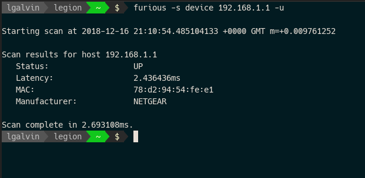
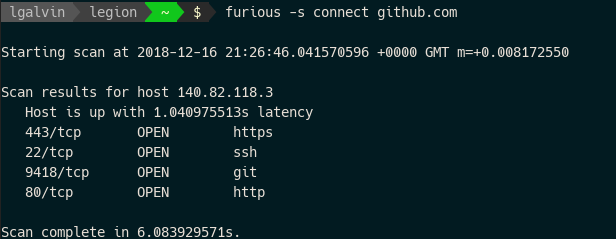

# Furious IP/Port Scanner

Furious is a fast, lightweight, portable network scanner.




Tested on Mac/Linux, may also work on Windows!

## Install

```
go get -u github.com/liamg/furious
```

## Options

### `-s [TYPE]` `--scan-type [TYPE]`

Use the specified scan type. The options are:

| Type       | Description |
|------------|-------------|
| `syn`      | A SYN/stealth scan. Fastest and usual preferred scan type, using only a partial TCP handshake. Requires root privileges.
| `connect`  | A slower, less detailed scan using full TCP handshakes, though does not require root privileges. 
| `device`   | Attempt to identify device MAC address and manufacturer where possible. Useful for listing devices on a LAN.

The default is a SYN scan.

### `-p [PORTS]` `--ports [PORTS]`

Scan the specified ports. Defaults to a list of all known ports as [provided by IANA](https://www.iana.org/assignments/service-names-port-numbers/service-names-port-numbers.xhtml).

Ports may be specified using a comma delimited list, and ranges are also allowed.

For example:

```
--ports 22,80,443,8080-8082
```

...will scan 22, 80, 443, 8080, 8081, and 8082.

### `-t [MS]` `--timout-ms [MS]`

The network timeout to apply to each port being checked. Default is *1000ms*.

### `-w [COUNT]` `--workers [COUNT]`

The number of worker routines to use to scan ports in parallel. Default is *1000* workers.

### `-u` `--up-only`

Only show output for hosts that are confirmed as up.

### `--version`

Output version information and exit.

## Usage

Furious can be used to:

### Find open ports on one or more hosts

Scan a single host:
```
furious 192.168.1.4 
```

Scan a whole CIDR:
```
furious 192.168.1.0/24 
```

### Scan a mixture of IPs, hostnames and CIDRs

```
furious -s connect 8.8.8.8 192.168.1.1/24 google.com
```

### Run a SYN (stealth) scan (with root privileges)

```
sudo -E furious -s syn 192.168.1.1
```

### Run a connect scan as any user

```
furious -s connect 192.168.1.1
```

### Identify device MAC address and manufacturer within a local network

```
furious -s device 192.168.1.1/24 -u
```

## Troubleshooting

### `sudo: furious: command not found`

If you installed using go, your user has the environment variables required to locate go programs, but root does not. You need to:

```
sudo env "PATH=$PATH" furious
```

## SYN/Connect scans are slower than nmap!

They're not in my experience, but with default arguments furious scans nearly six times as many ports as nmap does by default.